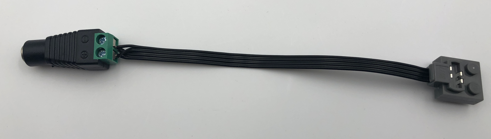

# General Notes

Following [these](https://learn.adafruit.com/circuitpython-on-any-computer-with-ft232h/overiew)
instructions is helpful as an in depth reference.

## Install pip
```
sudo apt-get remove python-pip
sudo apt-get remove python3-pip
```

## Install Dependencies
```
python3 -m pip install pyftdi
python3 -m pip install adafruit-blinka
python3 -m pip install pygame
python3 -m pip install pyqt5
python3 -m pip install pip install PyUserInput

sudo apt install xdotool
```

Need to export the correct env variable
```
export BLINKA_FT232H=1
# this is done automatically in the code but is detailed here for troubleshooting purposes.
```

## busio Documentation
[busio](https://circuitpython.readthedocs.io/en/latest/shared-bindings/busio/#busio.I2C)

## Lego PF without batteries

Powering the Lego Power Functions directly from a power supply is rather straightofrward and can be acomplished by following the steps.
1. Take an available [extension cable](https://www.lego.com/en-us/product/lego-power-functions-extension-wire-8886) and cut one end to expose the wire leads. Ensure the end that remains is combatible with your other devices. It was frequently obsvered that retaining the dark gray end of the extansion cable was preferred.
2. Using the picture below
    - take the lowermost and 3rd lower most wires and connect them to the + lead.
    - take the second lowermost and top cable and connect them to the - lead.



